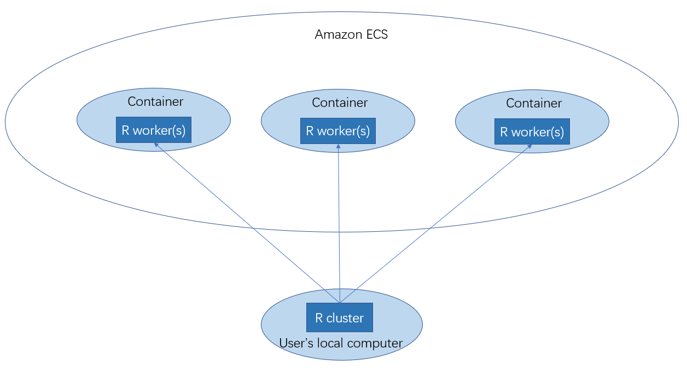

# Introduction
Parallel computing has became an important tool to analysis large and complex data. Using the `parallel` package to create local computing cluster is probably the most well-known method for the parallel computing in R's realm. As the advance of the cloud computing, there is a natural need to make R parallel compatible with the cloud. `DockerParallel` is a package that is designed for the cloud computation. It aims to provide easy-to-learn, highly scalable and low-cost tools to make the cloud computation possible.

The core component of `DockerParallel`, as its name implies, is the docker container. Container is a technique to package up code and all its dependencies in a standard unit and run it on an isolated environment from the host OS. By containerizing R's worker node, `DockerParallel` can easily deploy hundreds of identical workers in a cloud environment regardless of the host hardware and OS that run the nodes. In this vignette, we will demonstrate how to use `DockerParallel` to run a cluster using Amazon Elastic Compute Service(ECS).

# The framework of ECS
Since the container provides a standard working environment regardless of its host OS, configuring the cloud server is purely for meeting the requirement of the container and  becomes a boring task. Thus, Amazon provides Elastic Compute Service to take over the management of servers. By using ECS, the user only needs to prepare the container image and ECS will automatically find the best server to run the container. ECS provides both the traditional server and fargate as the host machine of the container. For the traditional server, the user is able to select a set of hardware that can run the container. For the fargate launch type, it does not refer to any particular server. The choice of the server is determined by Amazon and is opaque to the user. The user only need to specify the CPU and memory that a container needs. Therefore, it greatly simplifies the deployment of the container. We will use the fargate launch type as an example to demonstrate the package. Below is the diagram of how `DockerParallel` works with ECS



The cluster is created in your local R session, but the workers are from Amazon ECS. Each docker container runs one or more R workers, they will receive jobs sent by your local R session and do the parallel computing. The workflow of the `DockerParallel` package is as follow

1. set the ssh key pair
2. Authenticate with a cloud provider
3. Configure the hardware of the worker node
4. Create the cluster and run your parallel task

In the rest of the vignette we will introduce them step by step


# Set the ssh key pair
The first step of using the package is to set the ssh key. The public key should be known by the container so it will allow the connection from your local cluster. You can set the path to the key file via `set_ssh_key(private_key = "private key path", public_key = "public key path")`. If no argument is provided to `set_ssh_key`, it will find the key by the environment variables `DockerParallelSSHPrivateKey` and `DockerParallelSSHPublicKey`
```
set_ssh_key()
```
Note that if you use the environment variable to set the ssh key, it will be automatically located by the package, there is no need to call `set_ssh_key`.


# Authentication

For communicating with the cloud, you need to authenticate with the cloud provider. Amazon cloud uses `access key id` and `secret access key` to verify your identity. You can find the instruction on how to download your credentials from [AWS Documentation]. Once you have the credentials, you can specify them by

```r
ecs_set_credentials()
#> $access_key_id
#> [1] "AK**************OYX3"
#> 
#> $secret_access_key
#> [1] "mL**********************************XGGH"
#> 
#> $region
#> [1] "us-east-1"
```
`ecs_set_credentials` will determine your credentials as well as the region of the cloud service. The region is the physical location of the cloud servers that will run your worker nodes. The function uses a variety of ways to find such information. The most important methods are as follow(sorted by the search order):

1. user-supplied values passed to the function

2. environment variables `AWS_ACCESS_KEY_ID`, `AWS_SECRET_ACCESS_KEY`, `AWS_DEFAULT_REGION`, and `AWS_SESSION_TOKEN`

You can either explicitly specify them or provide them as environment variables.

[AWS Documentation]: https://docs.aws.amazon.com/IAM/latest/UserGuide/id_credentials_access-keys.html#Using_CreateAccessKey

# configure worker node
The next step is to configure the hardware and docker image of your worker nodes. The information of the worker nodes is stored as an S4 class, you can get a default one from

```r
config <- ecs_configuration()
config
#> cluster_name:	R-worker-cluster 
#> cpu:		256  CU
#> memory:		512  MB
#> image:	szwjf08/dockerparallel-worker-image
```
The most important settings are the CPU and memory of the worker node. The value for the CPU represents the CPU units(CU) used by a worker node. A single CPU core corresponds to 1024 CU. The unit for the memory is MB. The default setting gives you the minimum hardware for a worker node. You can specify up to 4096 CU and 30GB memory for a worker. Note that not all combinations of the CPU and memory are valid in ECS. If you provide an invalid combination, the resulting workers will have at least that much CPU units and memory you specified. Please see [AWS Fargate limit] For the valid combinations. The image is the image containing the worker node. Currently this is a fixed value, but in future we will allow users to choose a customized image.

The cost of the workers will be based on the duration of the workers. Pricing is per second with a 1-minute minimum. The unit price for the workers will be calculated from the region, CPU and memory that you specified. You can find more detail from [AWS Fargate Pricing]

[AWS Fargate Pricing]: https://aws.amazon.com/fargate/pricing/
[AWS Fargate limit]: https://docs.aws.amazon.com/AmazonECS/latest/developerguide/task-cpu-memory-error.html

# Create cluster
The last step is to create your cluster. It can be done by

```r
cl <- docker_cluster(config, workers = 2)
cl
#> Socket cluster with 2 nodes where 2 nodes are on host '54.158.55.112' (R version 4.0.3 (2020-10-10), platform x86_64-pc-linux-gnu)
```
The function takes the `config` object as the worker template to create workers on ECS. The variable `workers` determine the number of workers in the cluster. It will create a cluster with 2 worker nodes. After the cluster is created, you can treat the cluster as the one returned by `parallel::makeCluster` and do your computation as usual. For example

```r
parallel::parLapply(cl, 1:4, function(i) runif(i))
#> [[1]]
#> [1] 0.4139445
#> 
#> [[2]]
#> [1] 0.7024857 0.6977749
#> 
#> [[3]]
#> [1] 0.4098401 0.1065834 0.9656709
#> 
#> [[4]]
#> [1] 0.16362841 0.49228986 0.01090621 0.95961565
```
This will dispatch your parallel task to the worker nodes you just created. After you finish your work, the cluster can be closed by

```r
parallel::stopCluster(cl)
```

# Session info

```r
sessionInfo()
#> R Under development (unstable) (2020-09-03 r79126)
#> Platform: x86_64-w64-mingw32/x64 (64-bit)
#> Running under: Windows 10 x64 (build 19041)
#> 
#> Matrix products: default
#> 
#> locale:
#> [1] LC_COLLATE=English_United States.1252  LC_CTYPE=English_United States.1252   
#> [3] LC_MONETARY=English_United States.1252 LC_NUMERIC=C                          
#> [5] LC_TIME=English_United States.1252    
#> 
#> attached base packages:
#> [1] stats     graphics  grDevices utils     datasets  methods   base     
#> 
#> other attached packages:
#> [1] DockerParallel_0.99.0
#> 
#> loaded via a namespace (and not attached):
#>  [1] rstudioapi_0.13     parallelly_1.23.0   knitr_1.30          xml2_1.3.2         
#>  [5] magrittr_1.5        pkgload_1.1.0       aws.signature_0.6.0 rjson_0.2.20       
#>  [9] R6_2.5.0            rlang_0.4.8         fansi_0.4.1         stringr_1.4.0      
#> [13] httr_1.4.2          tools_4.1.0         parallel_4.1.0      xfun_0.19          
#> [17] cli_2.1.0           withr_2.3.0         htmltools_0.5.0     assertthat_0.2.1   
#> [21] digest_0.6.27       rprojroot_2.0.2     crayon_1.3.4        base64enc_0.1-3    
#> [25] curl_4.3            testthat_3.0.0      evaluate_0.14       glue_1.4.2         
#> [29] stringi_1.5.3       compiler_4.1.0      desc_1.2.0          jsonlite_1.7.1
```

