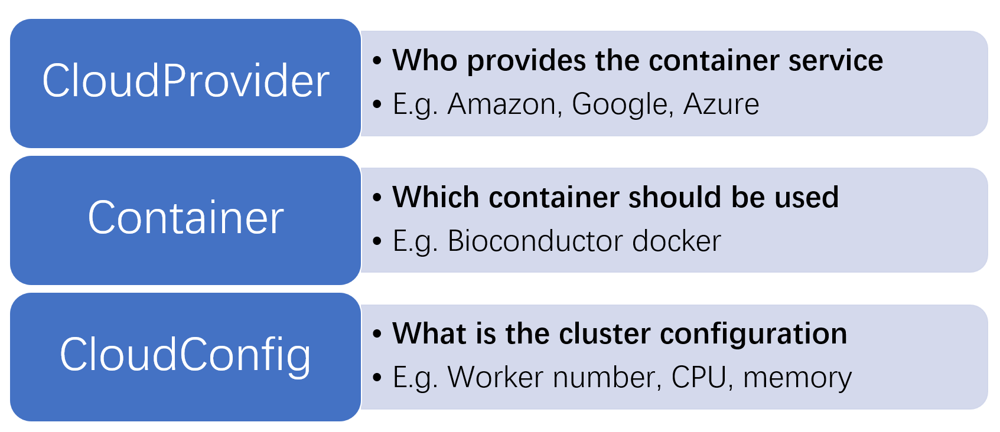
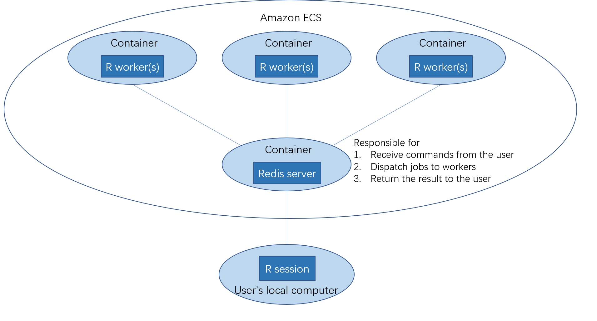

# Introduction
Parallel computing has became an important tool to analysis large and complex data. Using the `parallel` package to create local computing cluster is probably the most well-known method for the parallel computing in R's realm. As the advance of the cloud computing, there is a natural need to make R parallel compatible with the cloud. `DockerParallel` is a package that is designed for the cloud computation. It aims to provide easy-to-learn, highly scalable and low-cost tools to make the cloud computation possible.

The core component of `DockerParallel`, as its name implies, is the docker container. Container is a technique to package up code and all its dependencies in a standard unit and run it in an isolated environment from the host OS. By containerizing R's worker node, `DockerParallel` can easily deploy hundreds of identical workers in a cloud environment regardless of the host hardware and OS that run the nodes. In this vignette, we will demonstrate how to use `DockerParallel` to run a cluster using Amazon Elastic Compute Service(ECS). The purpose of this vignette is providing the basic usage of the package for the user. For more information, please see the R markdown file `advanced-topics` and `cookbook-for-developers`.

# The structure of `DockerParallel`
For understanding the structure of `DockerParallel`, imagine that if someone tells you to create an R parallel cluster on the cloud using the container, what question you will ask before you can deploy the cluster on the cloud? Generally speaking, the cluster depends on the answers to the three questions:

1. Which container should be used?
2. Who provides the container service?
3. What is the cluster configuration(e.g. worker number, CPU, memory)?

`DockerParallel` answers these questions via three components:  `Container`, `CloudProvider` and `CloudConfig`. These components can be summarized in the following figure



We would not discuss the technical details of these components as they should be only interesting for the developer. Users only need to pick up the appropriate components and create the cluster with the properties they need. 

# The structure of ECS
Amazon provides Elastic Compute Service to take over the management of servers. By using ECS, the user only needs to prepare the container image and ECS will find the best server to run the container. ECS provides both the traditional server and fargate as the host machine of the container. For the traditional server, the user is able to select a set of hardware that can run the container. For the fargate launch type, it does not refer to any particular server. The choice of the server is determined by Amazon and is opaque to the user. The user only need to specify the CPU and memory that a container needs. Therefore, it greatly simplifies the deployment of the container. 

In this vignette, We use the foreach redis parallel backend and deploy the container using the ECS fargate launch type. Below is the diagram of how `DockerParallel` works with ECS and Bioconductor foreach redis container



The cluster object is created in your local R session, but the workers and redis server are from Amazon ECS. Each docker container contains one or more R workers, they will receive jobs sent by your local R session and do the parallel computing. The workflow of the `DockerParallel` package is as follow

1. Select a cloud provider(default: ECSProvider)
2. Select a container(default: BiocFERContainer)
3. Create the cluster and run your parallel task

In the rest of the vignette we will introduce them step by step


# Select a cloud provider
Even though the topic says "select", currently the only available cloud provider is the before-mentioned ECS fargate provider. You can call `ECSProvider` to create an ECS fargate provider 

```r
provider <- ECSCloudProvider()
provider
#> Cluster name:         R-worker-cluster 
#> Server task definition:      R-server-task-definition 
#> Worker task definition:      R-worker-task-definition 
#> Security group name:  R-parallel-security-group
```
We would not discuss the details of the cloud provider in this vignette as it is off-topic for using the package, users only need to know that the cloud provider is changeable and different providers provide different cloud service.

## Credentials
For communicating with the cloud, you need to authenticate with the cloud provider. Amazon cloud uses `access key id` and `secret access key` to verify your identity. You can find the instruction on how to download your credentials from [AWS Documentation]. The ECS fargate provider uses `aws_set_credentials` from the package `aws.ecx` to find your credentials

```r
aws.ecx::aws_set_credentials()
#> $access_key_id
#> [1] "AK**************OYX3"
#> 
#> $secret_access_key
#> [1] "mL**********************************XGGH"
#> 
#> $region
#> [1] "ap-southeast-1"
```
`aws_set_credentials` determines your credentials as well as the region of the cloud service. The region is the physical location of the cloud servers that will run your worker nodes. The function uses a variety of ways to find such information. The most important methods are as follow(sorted by the search order):

1. user-supplied values passed to the function

2. environment variables `AWS_ACCESS_KEY_ID`, `AWS_SECRET_ACCESS_KEY`, `AWS_DEFAULT_REGION`, and `AWS_SESSION_TOKEN`

You can either explicitly specify them or provide them as environment variables.

[AWS Documentation]: https://docs.aws.amazon.com/IAM/latest/UserGuide/id_credentials_access-keys.html#Using_CreateAccessKey

# Select a container
Similar to the cloud provider, the container is also changeable and provide different running environment and parallel backend. Currently the only available container is `BiocFERContainer`(stands for `Bioconductor ForEach Redis Container`). Since the parallel framework requires both server and worker nodes, users can create the server and worker container via

```r
serverContainer <- getBiocFERServerContainer()
workerContainer <- getBiocFERWorkerContainer()
serverContainer
#> Bioconductor foreach redis container reference object
#>   Image:      dockerparallel/parallel-redis-server 
#>   maxWorkers: 1 
#>   Environment variables:
workerContainer
#> Bioconductor foreach redis container reference object
#>   Image:      dockerparallel/parallel-redis-worker 
#>   maxWorkers: 4 
#>   Environment variables:
```


# Create the cluster and run your parallel task
Once you have selected the provider and containers, you can create the cluster via

```r
cluster <- makeDockerCluster(workerCpu = 1024, workerMemory = 2048, cloudProvider = provider, serverContainer = serverContainer, workerContainer = workerContainer)
```
where `workerCpu` defines the CPU unit used by the worker container, 1024 CPU unit corresponds to a single CPU core. `workerMemory` defines the worker memory and the unit is `MB`. Note that `makeDockerCluster` will use the ECS fargate provider and Bioconductor foreach redis container by default, we explicitly provide these arguments here just for reminding you that these are changeable.

You may wonder how to set the worker number for a cluster, this can be done after you have create the cluster

```r
cluster$setWorkerNumber(2)
```
Until now, the cluster has not been started and nothing is running on the cloud, you need to start the cluster by

```r
cluster$startCluster()
#> Initializing the ECS provider
#> Launching server
#> Error in getSSHPubKey(): could not find function "getSSHPubKey"
```
Once the cluster has been started, you can use the `foreach` function to do the parallel computing as usual

```r
library(foreach)
foreach(i = 1:2)%dopar%{
   Sys.info()
}
#> [[1]]
#>           sysname           release           version          nodename           machine 
#>         "Windows"          "10 x64"     "build 19042" "DESKTOP-FDNSBFE"          "x86-64" 
#>             login              user    effective_user 
#>        "Zhou Jin"        "Zhou Jin"        "Zhou Jin" 
#> 
#> [[2]]
#>           sysname           release           version          nodename           machine 
#>         "Windows"          "10 x64"     "build 19042" "DESKTOP-FDNSBFE"          "x86-64" 
#>             login              user    effective_user 
#>        "Zhou Jin"        "Zhou Jin"        "Zhou Jin"
```
After finishing the computation, you can stop the cluster via

```r
cluster$stopCluster()
#> Stopping cluster
```
By default, the cluster will step itself if it has been removed from the R session, but we recommended to explicitly stop it after use.

# Session info

```r
sessionInfo()
#> R version 4.0.4 (2021-02-15)
#> Platform: x86_64-w64-mingw32/x64 (64-bit)
#> Running under: Windows 10 x64 (build 19042)
#> 
#> Matrix products: default
#> 
#> locale:
#> [1] LC_COLLATE=English_United States.1252  LC_CTYPE=English_United States.1252   
#> [3] LC_MONETARY=English_United States.1252 LC_NUMERIC=C                          
#> [5] LC_TIME=English_United States.1252    
#> 
#> attached base packages:
#> [1] stats     graphics  grDevices utils     datasets  methods   base     
#> 
#> other attached packages:
#> [1] readr_1.4.0           DockerParallel_0.99.0 foreach_1.5.1        
#> 
#> loaded via a namespace (and not attached):
#>  [1] xfun_0.19           remotes_2.2.0       purrr_0.3.4         vctrs_0.3.4        
#>  [5] testthat_3.0.2      usethis_1.6.3       htmltools_0.5.0     yaml_2.2.1         
#>  [9] base64enc_0.1-3     rlang_0.4.10        pkgbuild_1.1.0      pillar_1.4.6       
#> [13] glue_1.4.2          withr_2.3.0         doRedis_2.0.1       sessioninfo_1.1.1  
#> [17] lifecycle_0.2.0     stringr_1.4.0       commonmark_1.7      devtools_2.3.2     
#> [21] codetools_0.2-18    memoise_1.1.0       evaluate_0.14       knitr_1.31         
#> [25] callr_3.5.1         ps_1.4.0            parallel_4.0.4      curl_4.3           
#> [29] Rcpp_1.0.5          BiocManager_1.30.10 desc_1.2.0          pkgload_1.1.0      
#> [33] jsonlite_1.7.2      adagio_0.7.1        fs_1.5.0            rjson_0.2.20       
#> [37] hms_0.5.3           digest_0.6.27       stringi_1.5.3       processx_3.4.4     
#> [41] rprojroot_2.0.2     cli_2.3.1           tools_4.0.4         magrittr_1.5       
#> [45] tibble_3.0.4        aws.ecx_1.0.4       cluster_2.1.0       crayon_1.3.4       
#> [49] aws.signature_0.6.0 pkgconfig_2.0.3     ellipsis_0.3.1      redux_1.1.0        
#> [53] xml2_1.3.2          prettyunits_1.1.1   assertthat_0.2.1    rmarkdown_2.7      
#> [57] httr_1.4.2          roxygen2_7.1.1      rstudioapi_0.13     iterators_1.0.13   
#> [61] R6_2.5.0            compiler_4.0.4
```

