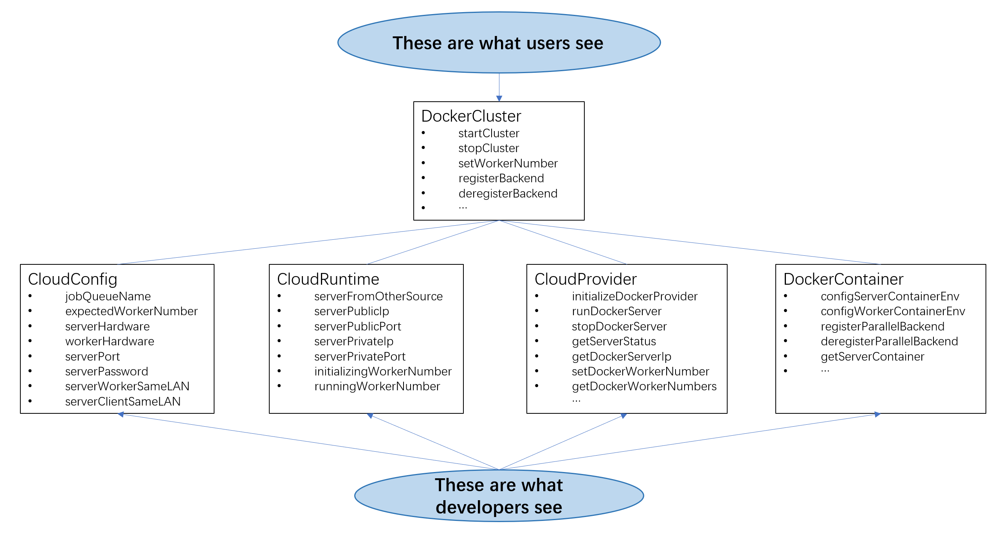

```{r, include = FALSE}
knitr::opts_chunk$set(
  collapse = TRUE,
  comment = "#>"
)
library(DockerParallel)
```

# Introduction
This document is designed for the developer who want to create a cloud provider or container extension for the `DockerParallel` package. We will discuss the structure of the package and calling order of the package function.

## Package structure
The package assumes a server-worker-client structure, their relationship can be summarized as follow

{width=90%}

When the user creates a `DockerCluster` object, the object serves as the client. The server will receive the computation jobs from the client and send them to the workers. The server and workers are defined by the `DockerContainer` objects. They can be dynamically created on the cloud using the functions provided by the corresponding `CloudProvider` object. However, it is possible to have the server and some workers running outside of the cloud as the user might have them in some other platforms.

The design of the package is twofold. It contains two sets of APIs, user APIs and developer APIs. The user APIs are called by the user to start the cluster on the cloud. The developer APIs are all S4 generics and should be defined by the developer to collect the container information and deploy the container on the cloud. Below shows the difference between the user and developer APIs

{width=90%}

The user issues the high-level command to the `DockerCluster` object(e.g. `startCluster`). The `DockerCluster` object will call the downstream functions to supply what the user needs. `DockerCluster` class contains fives major slots, `cloudConfig`, `cloudRuntime`, `cloudProvider`, `serverContainer` and `workerContainer`.
`CloudConfig` stores the cluster static settings such as  `jobQueueName` and `workerNumber`.
`CloudRuntime` keeps the runtime information of the server and workers. `CloudProvider` provides the functions to run the container on the cloud and `DockerContainer` defines which container should be used. As the cluster might need to deploy both the server and workers, the `DockerCluster` object defines both `serverContainer` and `workerContainer` as its slots. Since a `DockerCluster` object corresponds to a cluster on the cloud, all the before-mentioned components behave like the environment object in R. Therefore, it is possible to change the value in the `DockerCluster` object inside a function and broadcast the effect to the same object outside of the function.

The reference class `CloudProvider` and `DockerContainer` are generalizable, the developer can define a new cloud provider by defining a new class which inherits `CloudProvider`. The same rule applies to `DockerContainer` as well. In the rest of the document, we will discuss the implementation details of the `DockerCluster` object.

## The big picture
In this section, we use the function `DockerCluster$startCluster` as an example to show how the components of the `DockerCluster` object work together to deploy a cluster on the cloud.

{width=90%}

The gray color means the function is from `DockerCluster`, red means the `CloudProvider` and blue means the `DockerContainer`. Note that the flowchart only contains these three classes as `CloudConfig` and `CloudRuntime` are purely the class for storing the cluster information. In most cases, it is `DockerCluster`'s job to manage the data in the cluster, there is no need to change the value of `CloudConfig` and `CloudRuntime` in the function defined for `CloudProvider` or `DockerContainer`. The only exception is the function `reconnectDockerCluster` where the cloud provider is responsible for setting all the values in the cluster.

## Accessor functions
The package provides getters/setters for the developer to access the values in the `DockerCluster` object. The first argument is always the `DockerCluster` object. The high-level accessors are
```{r eval=FALSE}
.getCloudProvider
.getCloudConfig
.getServerContainer
.getWorkerContainer
.getCloudRuntime
```
Note that there are no setters for them as they are of the reference class. The accessors for the `CloudConfig` values are
```{r eval=FALSE}
## Getter
.getJobQueueName
.getExpectedWorkerNumber
.getWorkerHardware
.getServerHardware
.getServerWorkerSameLAN
.getServerClientSameLAN
.getServerPassword
.getServerPort

## Setter
.setJobQueueName
.setExpectedWorkerNumber
.setWorkerHardware
.setServerHardware
.setServerWorkerSameLAN
.setServerClientSameLAN
.setServerPassword
.setServerPort
```
The accessors for the `CloudRuntime` values are
```{r eval=FALSE}
## Getter
.getServerFromOtherSource
.getServerPrivateIp
.getServerPrivatePort
.getServerPublicIp
.getServerPublicPort

## Setter
.setServerFromOtherSource
.setServerPrivateIp
.setServerPrivatePort
.setServerPublicIp
.setServerPublicPort
```
In most cases, only the getter are required to be called by the developer when developing the cloud provider or the container.


# The docker container
`DockerContainer` defines the docker image and its environment variables. Its class definition is
```{r eval=FALSE}
setRefClass(
    "DockerContainer",
    fields = list(
        name = "character",
        backend = "character",
        maxWorkerNum = "integer",
        environment = "list",
        image = "character"
    )
)
```
where `name` is the name of the container and backend is the name of the parallel backend used by the cluster. `maxWorkerNum` defines the maximum number of workers that can be run in the same container. `environment` is the environment variable in the container. `image` is the image used by the container. Note that a minimum container should define at least the `image` slot. The other slots are optional.

The generic function for the `DockerContainer` class are
```{r eval=FALSE}
configServerContainerEnv
configWorkerContainerEnv
registerParallelBackend
deregisterParallelBackend
getServerContainer
getExportedNames
getExportedObject
```
A minimum container should override `configServerContainerEnv`, `configWorkerContainerEnv`, `registerParallelBackend` and `deregisterParallelBackend`. The rest is optional.


## Configure the container environment
The motivation for configuring the container environment is to allow developer to pass the cluster data(e.g. server password) to the container before deploying it on the cloud(please see [The big picture](#The-big-picture)). Therefore, server can be password protected and worker can find the server via the settings in the environment variable. The function prototypes are

```{r}
getGeneric("configServerContainerEnv")
```
and
```{r}
getGeneric("configWorkerContainerEnv")
```
where `container` is the worker container and `cluster` is the `DockerCluster` object. `workerNumber` defines how many workers should be run in the same container. Please keep in mind that the user might also define the environment variables in the container, so you should insert your environment variables to `DockerContainer$environment`, not overwrite the entire environment object.

Since the container object is a reference object, it is recommended to call `$copy()` before set the environment variable to avoid the side affect.

## Parallel backend
It is the container's duty to register the parallel backend as neither the cloud provider nor the cluster knows which backend your container supports and how to register it. The function prototypes are
```{r}
getGeneric("registerParallelBackend")

```
and
```{r}
getGeneric("deregisterParallelBackend")
```
where `container` is the worker container and `cluster` is the `DockerCluster` object. The backend can be anything defined globally that allow the user to do the parallel computing. The popular parallel frameworks  are `foreach` and `BiocParallel`. Other frameworks are also possible. The default `deregisterParallelBackend` can deregister the foreach backend. If your backend is not from `foreach`, you should define `deregisterParallelBackend`.

## Server container
The function `getServerContainer` is purely for obtaining the server container from the worker container. By doing so the user only need to provide the worker container to the cluster. The prototype is
```{r}
getGeneric("getServerContainer")
```
This function is optional, but we recommend to define it as otherwise the user must explicitly provide both the server and worker container to the cluster if both need to be deployed by the cloud.

## Extension to the container
You can export the functions and variables in the container via `getExportedNames` and `getExportedObject`. The prototypes are
```{r}
getGeneric("getExportedNames")
```
and
```{r}
getGeneric("getExportedObject")
```
`getExportedNames` defines the exported names and `getExportedObject` gets the exported object.
They will be called by the cluster and the user can see the exported objects from `DockerCluster$serverContainer$...` and `DockerCluster$workerContainer$...`. 

If the exported object is a function, the exported function will be defined in an environment such that the `DockerCluster` object is implicitly assigned to the variable `cluster`. In other words, the exported function can use the variable `cluster` without defining it. For example, if we export the function
```{r eval=FALSE}
foo <- function(){
  cluster$startCluster()
}
```
the user can call `foo` via `DockerCluster$workerContainer$foo()` with no argument and the cluster will be started. This can be useful if the developer needs to change anything in the cluster without asking the user to provide the `DockerCluster` object. If the function has the argument  `cluster`, the argument will be removed from the function when the function is exported to the user. The user would not be bothered with the redundant `cluster` argument.

# The cloud provider
`CloudProvider` provides functions to deploy the container on the cloud. Its generic functions are
```{r eval=FALSE}
initializeCloudProvider
runDockerServer
stopDockerServer
getServerStatus
getDockerServerIp
setDockerWorkerNumber
getDockerWorkerNumbers
dockerClusterExists
reconnectDockerCluster
cleanupDockerCluster
```
most function names should be self-explained and we will introduce them in the following sections. A minimum cloud provider only needs to define `runDockerServer`, `stopDockerServer`, `getDockerServerIp`, `setDockerWorkerNumber`. However, many important features will be missing if you do not define the optional functions.

## Initialize the cloud provider
`initializeCloudProvider` allows the developer to initialize the cloud provider. It will be automatically called by the `DockerCluster` before running the server and workers on the cloud. This function can be omitted if the cloud provider does not require any initialization. Its generic is
```{r}
getGeneric("initializeCloudProvider")
```
where the `provider` is the cloud provider object, `cluster` is the `DockerCluster` object which contains the `provider`. `verbose` is an integer showing the verbose level.

## run the server/worker container
`runDockerServer` and `setDockerWorkerNumber` implement the core functions of the cloud provider. The generics are
```{r}
getGeneric("runDockerServer")

getGeneric("setDockerWorkerNumber")
```
where `container` should be an object that inherits from `DockerContainer`. `hardware` is from the class `DockerHardware`. `workerNumber` indicates how many workers should be run on the cloud. There is no return value for these generics.

The provider needs to make sure the worker number meets the user requirement. If some workers are died due to an unexpected reason, `DockerCluster` will call `setDockerWorkerNumber` to ask the provider to update the workers.

Not all slots in the `container` object need to be used by the cloud provider. Only the slots `name`, `environment` and `image` should be handled. The `environment` slot in the container has been configured before passing to the cloud provider as [The big picture](#The-big-picture)) shows. However, the worker number is set to 1 for each container. If the cloud provider have enough resources to support multiple workers in one container, the provider should call `configWorkerContainerEnv` with the new worker number again to overwrite the previous settings. This can make the worker deployment faster sometimes. It is providers responsibility to make sure the worker number does not exceed the number limitation specified in `container$maxWorkerNum`

The argument `hardware` specifies the hardware for each container. As the hardware is different for each cloud provider, the base class `DockerHardware` only contains the most import hardware parameters, that is, it only has the slots `cpu`, `memory` and `id`. Although the cluster does not have any hard restriction on how these three parameters will be explained by the cloud provider, we recommend to explain them as follow

1. `cpu`: The CPU unit used by each worker, 1024 units corresponds to a physical CPU core.
2. `memory`: The memory in MB used by each worker.
3. `id`: The id of the hardware. It is a character that is only meaningful for the provider. This can be ignored if the cloud provider do not need this slot.

## Get the IPs of the running container
`getDockerServerIp` needs to return the public/private IP of the container. Its generic is
```{r}
getGeneric("getDockerServerIp")
```
The return value should be a name list with four elements `publicIp`, `publicPort`, `privateIp` and `privatePort`. If the server does not have the public endpoint, the public IP and port can be `NULL`.

## Get the worker status
The `DockerCluster` object will use `getDockerWorkerNumbers` to check the worker status. The prototype is 
```{r}
getGeneric("getDockerWorkerNumbers")
```
The return value is a named list with `initializing` and `running` elements. Each of them is an integer indicating how many workers are in that status.


## Check if the same cluster has existed on the cluster
Sometimes users might have a running cluster on the cloud and want to reuse the same cluster. The functions `dockerClusterExists` and `reconnectDockerCluster` are designed to achieve it. The generics are
```{r}
getGeneric("dockerClusterExists")

getGeneric("reconnectDockerCluster")
```
Two cluster is considered the same if they have the same `jobQueueName` in `CloudConfig`.  Reconnecting to the same cluster is tricky, the provider needs to store the cluster data in a secret place and recover them later as the user requests. The package provides `getDockerStaticData` to quickly extract the data from the cluster. The generic is
```{r}
getGeneric("getDockerStaticData")
```
Where `x` should be the `DockerCluster` object. The method for `DockerCluster` will apply the same generic again on `cloudConfig`, `workerContainer` and `serverContainer` to obtain the data in the slots of `DockerCluster`. 

When reconnecting, the provider can find the extracted data from the cloud and use `setDockerStaticData` to recover them. Its generic is
```{r}
getGeneric("setDockerStaticData")
```
The slot `cloudConfig`, `workerContainer` and `serverContainer` in the `DockerCluster` object will be recovered. `CloudRuntime` should be automatically updated by the function call to `getDockerServerIp` and `getDockerWorkerNumbers` after `reconnectDockerCluster` returns. Therefore, it is expected that the provider is functional once `reconnectDockerCluster` returns the control to the `DockerCluster` object. 

## Cleanup the cloud resources
The package provides `cleanupDockerCluster` to delete the resources on the cloud when the cluster is not needed. Its generic is
```{r}
getGeneric("cleanupDockerCluster")
```
where `deep` means whether to perform a deep cleanup. This generic will only be called when the cluster has been stopped and all server and workers has been removed. 

## Extension to the provider
The provider also supports exporting APIs to the user, it follows the same rule as the container and user can find them in `cluster$cloudProvider$...`. Please see [Extension to the container](#Extension-to-the-container)) for the details.


# Unit test for the extension
We provide a general purpose unit test function for the developers to test their extensions. The test function uses `testthat` framework. Since the package needs a provider and a container package to work, the developer needs to define both components in the test file. 
```{r eval=FALSE}
provider <- ECSFargateProvider::ECSFargateProvider()
container <- BiocFEDRContainer::BiocFEDRWorkerContainer()
generalDockerClusterTest(
  cloudProvider = provider, 
  workerContainer = container,
  workerNumber = 3L,
  testReconnect = TRUE)
```
Please see `?generalDockerClusterTest` for more information, 
